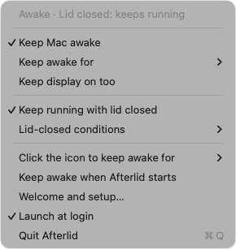
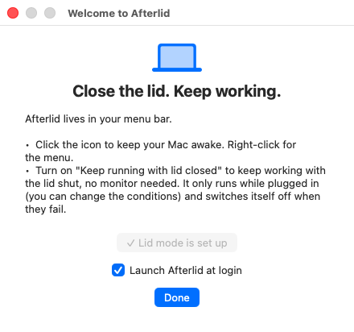

# Afterlid

**Close the lid. Keep working.**

Afterlid is a tiny macOS menu-bar app that keeps your Mac awake and can keep it running **with the lid closed and no external monitor**. Made for long-running work you don't want to babysit: coding agents, builds, renders, downloads, a home server on a laptop.

Free, no dependencies, one Swift file.

<p align="center"></p>

---

## Features

**Keep awake**
- Left-click the icon to toggle, right-click for the menu
- Indefinitely, or for 5, 10, 15, 30 minutes, or 1, 2, 4, 5, 8 hours
- Optional "keep the display on too"
- Optional "keep awake when Afterlid starts"

**Keep running with the lid closed**
- Works with no external monitor, keyboard, or mouse
- Conditions, all optional:
  - only when plugged in (on by default)
  - pause below a battery level (default 25%)
  - pause when the Mac is running hot
- Always switched back off when a condition fails, when you turn it off, or when Afterlid quits or crashes

**Command line**, so scripts and AI agents can control it (see below)

The menu-bar icon tells you the state at a glance:

| Icon | Meaning |
|---|---|
| ☕ outline | sleeps normally |
| ☕ filled | keeping the Mac awake |
| 💻 laptop | lid mode active: keeps running with the lid closed |
| 💻 laptop with ⚠ | lid mode wanted but paused (on battery, low battery, or hot) |
| red dot | lid mode still needs its one-time approval |

## Install

Requires macOS 13 or later and a Swift toolchain (Xcode or the Command Line Tools).

```bash
git clone https://github.com/zivgin/afterlid.git
cd afterlid
./build-app.sh
open /Applications/Afterlid.app
```

`build-app.sh` builds the app, installs it to `/Applications/Afterlid.app`, and installs the `afterlid` command to `~/.local/bin` (add that to your `PATH` if it isn't already). To start it automatically, right-click the icon and pick **Launch at login**.

## First launch

On first launch Afterlid shows a short welcome window where you can set up lid mode and turn on launch at login. You can open it again any time from the menu (**Welcome and setup…**).

<p align="center"></p>

## First-time approval for lid mode

The first time you turn on lid mode, Afterlid asks for your administrator password **once**, from the red bar at the top of the menu or with `afterlid setup`. After that, lid mode switches on and off with no password.

## Command line

```bash
afterlid                          # show status
afterlid setup                    # one-time approval for lid mode

afterlid awake on                 # keep awake indefinitely
afterlid awake on 90              # keep awake for 90 minutes
afterlid awake off

afterlid lid on                   # keep running with the lid closed
afterlid lid off

afterlid display on|off           # keep the screen on while awake
afterlid only-on-power on|off     # lid mode only when plugged in
afterlid battery-floor 30         # pause lid mode below 30% (0 = no limit)
afterlid pause-when-hot on|off    # pause lid mode when the Mac runs hot
```

Every command prints the resulting status. If the app isn't running, the CLI starts it.

Exit codes: `0` ok, `2` bad usage, `3` lid mode isn't approved yet.

**From a script or a coding agent**: wrap a long job so the Mac can't sleep under it, then let it rest again:

```bash
afterlid awake on && afterlid lid on
./long-running-job.sh
afterlid lid off && afterlid awake off
```

## Safety

Lid mode is genuinely useful and genuinely easy to misuse:

- **Don't put a running Mac in a bag.** With no airflow it gets hot fast. The "pause when hot" condition is a backstop, not a license.
- Keep **only when plugged in** on unless you know you want battery operation.
- When you're done, turn lid mode off so the lid sleeps the Mac normally again.

## Uninstall

```bash
afterlid lid off
osascript -e 'tell application "Afterlid" to quit'
rm -rf /Applications/Afterlid.app ~/.local/bin/afterlid
sudo rm /etc/sudoers.d/afterlid
defaults delete com.zivgin.afterlid
```

## Contributing

Bug reports, feature requests, and pull requests are welcome, see [CONTRIBUTING.md](CONTRIBUTING.md).

## License

MIT, see [LICENSE](LICENSE).
